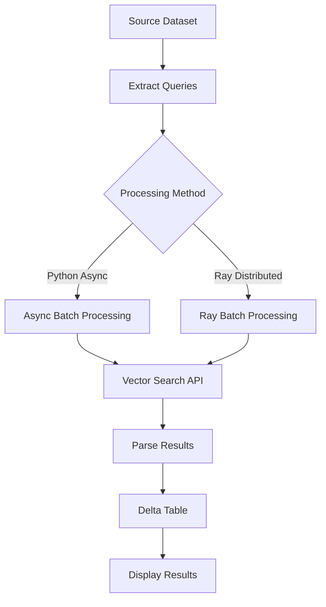

# Vector Search Batch Processing

This folder contains examples for performing batch vector search operations using Databricks Vector Search with different processing approaches and query types.

## 📂 Files Overview

| File | Description | Use Case |
|------|-------------|----------|
| `01-download-dataset.ipynb` | Downloads and prepares the IMDB dataset | Data preparation |
| `02-create-vector-search-index.ipynb` | Creates vector search index with embeddings | Index setup |
| `03-vs-async-batch-python.py` | Python async batch processing | < 1M records, serverless CPU |
| `03-vs-async-batch-ray.py` | Ray distributed batch processing | Large datasets, multi-node clusters |
| `old-02-vector-search-async-batch.ipynb` | Legacy version (deprecated) | Reference only |
| `vector-search-async-batch.py` | Alternative implementation | Reference only |

## 🚀 Quick Start

### Prerequisites
- Databricks workspace with Vector Search enabled
- Unity Catalog configured
- Required libraries: `databricks-vectorsearch`, `httpx`, `ray[default]` (for Ray version)

### Basic Workflow
1. **Data Preparation**: Run `01-download-dataset.ipynb` to download and prepare the IMDB dataset
2. **Index Creation**: Run `02-create-vector-search-index.ipynb` to create the vector search index
3. **Batch Processing**: Choose between Python async or Ray distributed processing

## 🔧 Configuration

### Common Settings
```python
# Unity Catalog Configuration
UC_CATALOG = "users"
UC_SCHEMA = "alex_miller"
VS_INDEX_NAME = "vs_batch_example"

# Vector Search Configuration
VECTOR_SEARCH_ENDPOINT = "abs_test_temp"
VECTOR_SEARCH_INDEX = f"{UC_CATALOG}.{UC_SCHEMA}.{VS_INDEX_NAME}"
SOURCE_DATASET = f"{UC_CATALOG}.{UC_SCHEMA}.imdb_embeddings"

# Column Configuration
ID_COLUMN = "id"
EMBEDDINGS_COLUMN = "embeddings"
TEXT_COLUMN = "text"
```

## 🎯 Query Types

### ANN (Vector-Only Search)
- **API Requirement**: Only `query_vector` allowed
- **Use Case**: Pure vector similarity search
- **Configuration**: `QUERY_TYPE = "ANN"`
- **Best For**: Finding semantically similar content based on embeddings

### HYBRID (Text + Vector Search)
- **API Requirement**: Both `query_text` and `query_vector` allowed
- **Use Case**: Combines semantic text matching with vector similarity
- **Configuration**: `QUERY_TYPE = "HYBRID"`
- **Best For**: Balanced search combining text and vector matching

## 🐍 Python Async Approach (`03-vs-async-batch-python.py`)

### Features
- ✅ Configurable concurrency (default: 100)
- ✅ Automatic retry logic with exponential backoff
- ✅ Memory-efficient processing
- ✅ All query types supported (ANN, HYBRID)
- ✅ Serverless CPU compatible

### Usage Example
```python
# Execute async batch processing
all_rows = await async_vector_search_batch(
    queries=query_texts,
    query_vector_list=query_vectors,
    lookup_ids=lookup_ids,
    index_name=VECTOR_SEARCH_INDEX,
    columns=[ID_COLUMN, EMBEDDINGS_COLUMN, TEXT_COLUMN],
    num_results=5,
    query_type="ANN",  # or "HYBRID"
    concurrency=100
)
```

### Performance Characteristics
- **Dataset Size**: < 1M records
- **Memory Usage**: Moderate (loads queries into memory)
- **Compute**: Single-node processing with async concurrency
- **Scalability**: Vertical scaling (more CPUs per node)

## ⚡ Ray Distributed Approach (`03-vs-async-batch-ray.py`)

### Features
- ✅ Distributed processing across multiple worker nodes
- ✅ Memory-efficient batch processing
- ✅ Automatic fault tolerance and retries
- ✅ All query types supported (ANN, HYBRID)
- ✅ Scales to very large datasets

### Usage Example
```python
# Configure Ray cluster
setup_ray_cluster(
    min_worker_nodes=1,
    max_worker_nodes=5,
    num_cpus_per_node=16,
    num_cpus_head_node=8
)

# Execute distributed batch processing
all_rows = ray_vector_search_batch(
    ray_ds=ray_ds,
    workspace_url=WORKSPACE_URL,
    index_name=VECTOR_SEARCH_INDEX,
    columns=[ID_COLUMN, EMBEDDINGS_COLUMN, TEXT_COLUMN],
    num_results=5,
    query_type="ANN",  # or "HYBRID"
    batch_size=50
)
```

### Performance Characteristics
- **Dataset Size**: > 1M records (no upper limit)
- **Memory Usage**: Very efficient (streaming processing)
- **Compute**: Multi-node distributed processing
- **Scalability**: Horizontal scaling (more worker nodes)

## 🔄 Data Flow



## 📊 Performance Comparison

| Aspect | Python Async | Ray Distributed |
|--------|-------------|----------------|
| **Dataset Size** | < 1M records | > 1M records |
| **Memory Usage** | Moderate | Very Low |
| **Setup Complexity** | Simple | Moderate |
| **Fault Tolerance** | Basic retry | Advanced |
| **Scalability** | Vertical | Horizontal |
| **Compute Type** | Single-node | Multi-node |

## 🛠️ Advanced Configuration

### Concurrency Tuning
```python
# Python Async
concurrency = 100  # Adjust based on API rate limits

# Ray Distributed
batch_size = 50    # Adjust based on memory constraints
max_worker_nodes = 5  # Scale based on cluster size
```

### Vector Format Handling
Both approaches automatically handle:
- Numpy arrays → Python lists conversion
- None/empty value checking
- Proper dimensionality validation
- API compatibility formatting

### Error Handling
- **Retry Logic**: Exponential backoff for transient errors
- **Rate Limiting**: Automatic handling of 429 responses
- **Timeout Management**: Configurable request timeouts
- **Graceful Degradation**: Continues processing on partial failures

## 🎯 Use Case Recommendations

### Choose Python Async When:
- Dataset size < 1M records
- Simple deployment requirements
- Serverless CPU compute
- Quick prototyping and testing

### Choose Ray Distributed When:
- Dataset size > 1M records
- Multi-node cluster available
- Complex data transformations needed
- Production-scale processing

## 📝 Example Configurations

### Movie Recommendation System
```python
QUERY_TYPE = "HYBRID"  # Combine text and vector similarity
NUM_RESULTS = 10       # Top 10 recommendations
```

### Content Deduplication
```python
QUERY_TYPE = "ANN"     # Pure vector similarity
NUM_RESULTS = 5        # Find duplicates
```

## 🔍 Troubleshooting

### Common Issues

**"await" allowed only within async function**
- Use `asyncio.run()` or run in Databricks notebook with top-level await support

**Memory errors with large datasets**
- Switch to Ray distributed approach
- Reduce batch_size parameter
- Increase cluster memory allocation

**API rate limiting (429 errors)**
- Reduce concurrency parameter
- Increase retry delays
- Check Vector Search endpoint quotas

**Vector dimension mismatches**
- Verify EMBEDDING_DIMENSION matches your model
- Check vector format (list vs numpy array)
- Validate source dataset schema

## 📚 Additional Resources

- [Databricks Vector Search Documentation](https://docs.databricks.com/machine-learning/vector-search.html)
- [Ray Documentation](https://docs.ray.io/en/latest/)
- [AsyncIO Best Practices](https://docs.python.org/3/library/asyncio.html)

## 🤝 Contributing

When adding new examples:
1. Follow the existing naming convention
2. Include comprehensive documentation
3. Add performance benchmarks
4. Test with different query types
5. Update this README with new capabilities 