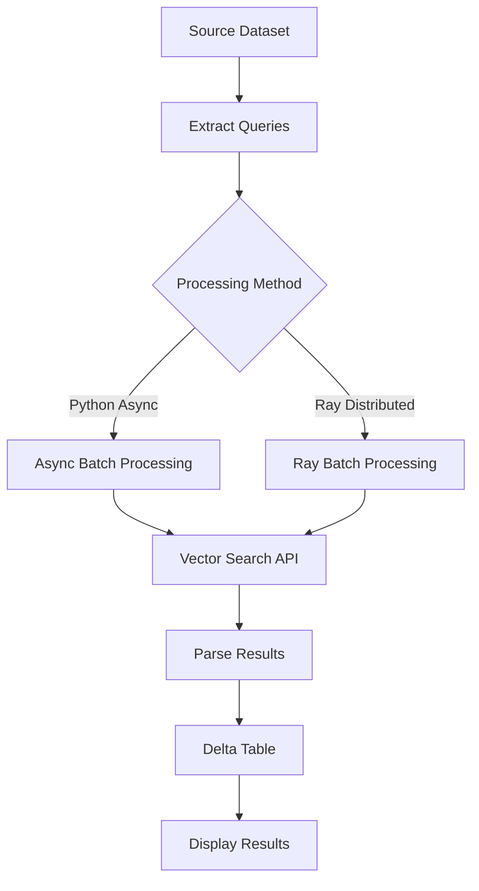

# Vector Search Batch Processing

This folder contains examples for performing batch vector search operations using Databricks Vector Search with different processing approaches and query types.

## 📂 Files Overview

| File | Description | Use Case |
|------|-------------|----------|
| `01-download-dataset.ipynb` | Downloads and prepares the IMDB dataset | Data preparation |
| `02-create-vector-search-index.ipynb` | Creates vector search index with embeddings | Index setup |
| `03-vs-async-batch-python.py` | Python async batch processing | < 1M records, serverless CPU |
| `03-vs-async-batch-ray.py` | Ray distributed batch processing | Large datasets, multi-node clusters |
| `config.py` | **Configuration management system** | **Centralized settings for all notebooks** |
| `old-02-vector-search-async-batch.ipynb` | Legacy version (deprecated) | Reference only |
| `vector-search-async-batch.py` | Alternative implementation | Reference only |

## 🚀 Quick Start

### Prerequisites
- Databricks workspace with Vector Search enabled
- Unity Catalog configured
- Required libraries: `databricks-vectorsearch`, `httpx`, `ray[default]` (for Ray version)

### Basic Workflow
1. **Data Preparation**: Run `01-download-dataset.ipynb` to download and prepare the IMDB dataset
2. **Index Creation**: Run `02-create-vector-search-index.ipynb` to create the vector search index
3. **Configuration**: Set up your configuration using `config.py`
4. **Batch Processing**: Choose between Python async or Ray distributed processing

### Quick Start with Configuration

#### Step 1: Choose Your Configuration Approach
```python
# Option A: Use defaults (quickest start)
from config import VectorSearchConfig
config = VectorSearchConfig()

# Option B: Use environment preset
from config import ConfigPresets
config = ConfigPresets.development()  # or staging, production

# Option C: Custom configuration
from config import load_config
config = load_config(
    uc_catalog="your_catalog",
    uc_schema="your_schema",
    vs_index_name="your_index",
    default_query_type="ANN"
)
```

#### Step 2: Verify Configuration
```python
# Print all configuration settings
config.print_config()

# Check specific values
print(f"Index: {config.vector_search_index}")
print(f"Source: {config.source_dataset}")
print(f"Query Type: {config.default_query_type}")
```

#### Step 3: Run Processing
- **Python Async**: Open `03-vs-async-batch-python.py` and run with your config
- **Ray Distributed**: Open `03-vs-async-batch-ray.py` and run with your config

## 🔧 Configuration System

Both notebooks now use a **centralized configuration system** via `config.py` that provides:
- ✅ **Type-safe configuration** with dataclass validation
- ✅ **Multiple configuration sources** (default, presets, environment variables, overrides)
- ✅ **Environment-specific settings** (dev, staging, production)
- ✅ **Easy customization** without editing core code

### Configuration Options

#### 1. **Default Configuration** (Quick Start)
```python
from config import VectorSearchConfig
config = VectorSearchConfig()  # Uses default values
```

#### 2. **Preset Configurations** (Environment-Specific)
```python
from config import ConfigPresets

# Development environment
config = ConfigPresets.development()

# Staging environment  
config = ConfigPresets.staging()

# Production environment
config = ConfigPresets.production()

# Testing environment
config = ConfigPresets.testing()
```

#### 3. **Environment Variables** (CI/CD Friendly)
```python
from config import load_config

# Load from environment variables
config = load_config(use_env=True)
```

Set these environment variables:
```bash
export UC_CATALOG="prod"
export UC_SCHEMA="vector_search"
export VS_INDEX_NAME="prod_vs_index"
export VECTOR_SEARCH_ENDPOINT="prod_vs_endpoint"
export SOURCE_TABLE_NAME="prod_embeddings"
export DEFAULT_QUERY_TYPE="HYBRID"
export DEFAULT_CONCURRENCY="100"
export MAX_SAMPLE_SIZE="10000"
```

#### 4. **Custom Overrides** (Flexible)
```python
from config import load_config

# Custom configuration with overrides
config = load_config(
    default_query_type="ANN",
    default_concurrency=50,
    max_sample_size=500,
    uc_catalog="my_catalog",
    uc_schema="my_schema"
)
```

#### 5. **Preset + Overrides** (Best of Both)
```python
from config import load_config

# Load staging preset with custom overrides
config = load_config(
    preset="staging",
    use_env=True,
    default_concurrency=75,
    max_sample_size=2000
)
```

### Configuration Parameters

| Parameter | Default | Description |
|-----------|---------|-------------|
| `uc_catalog` | `"users"` | Unity Catalog name |
| `uc_schema` | `"alex_miller"` | Unity Catalog schema |
| `vs_index_name` | `"vs_batch_example"` | Vector Search index name |
| `vector_search_endpoint` | `"abs_test_temp"` | Vector Search endpoint |
| `embedding_dimension` | `1024` | Vector embedding dimensions |
| `source_table_name` | `"imdb_embeddings"` | Source table name |
| `id_column` | `"id"` | ID column name |
| `embeddings_column` | `"embeddings"` | Embeddings column name |
| `text_column` | `"text"` | Text column name |
| `default_num_results` | `5` | Default number of results |
| `default_query_type` | `"HYBRID"` | Default query type |
| `default_concurrency` | `100` | Default concurrency level |
| `max_sample_size` | `1000` | Maximum sample size |
| `max_retries` | `5` | Maximum retry attempts |
| `backoff_factor` | `2.0` | Exponential backoff factor |
| `request_timeout` | `30` | Request timeout (seconds) |

### Environment-Specific Presets

#### Development Preset
```python
config = ConfigPresets.development()
# - Lower concurrency (20)
# - Smaller sample size (100)
# - Faster timeouts (15s)
# - Fewer retries (3)
```

#### Staging Preset
```python
config = ConfigPresets.staging()
# - Medium concurrency (50)
# - Medium sample size (1000)
# - Standard timeouts (30s)
# - Standard retries (5)
```

#### Production Preset
```python
config = ConfigPresets.production()
# - High concurrency (100)
# - Large sample size (10000)
# - Longer timeouts (60s)
# - Standard retries (5)
```

## 🎯 Query Types

### ANN (Vector-Only Search)
- **API Requirement**: Only `query_vector` allowed
- **Use Case**: Pure vector similarity search
- **Configuration**: `QUERY_TYPE = "ANN"`
- **Best For**: Finding semantically similar content based on embeddings

### HYBRID (Text + Vector Search)
- **API Requirement**: Both `query_text` and `query_vector` allowed
- **Use Case**: Combines semantic text matching with vector similarity
- **Configuration**: `QUERY_TYPE = "HYBRID"`
- **Best For**: Balanced search combining text and vector matching

## 🐍 Python Async Approach (`03-vs-async-batch-python.py`)

### Features
- ✅ Configurable concurrency (default: 100)
- ✅ Automatic retry logic with exponential backoff
- ✅ Memory-efficient processing
- ✅ All query types supported (ANN, HYBRID)
- ✅ Serverless CPU compatible

### Usage Example
```python
# Import and configure
from config import VectorSearchConfig, load_config

# Option 1: Default configuration
config = VectorSearchConfig()

# Option 2: Custom configuration
config = load_config(
    default_query_type="ANN",
    default_concurrency=50,
    max_sample_size=500
)

# Execute async batch processing using config
all_rows = await async_vector_search_batch(
    queries=query_texts,
    query_vector_list=query_vectors,
    lookup_ids=lookup_ids,
    index_name=config.vector_search_index,
    columns=config.get_column_list(),
    num_results=config.default_num_results,
    query_type=config.default_query_type,
    concurrency=config.default_concurrency
)
```

### Performance Characteristics
- **Dataset Size**: < 1M records
- **Memory Usage**: Moderate (loads queries into memory)
- **Compute**: Single-node processing with async concurrency
- **Scalability**: Vertical scaling (more CPUs per node)

## ⚡ Ray Distributed Approach (`03-vs-async-batch-ray.py`)

### Features
- ✅ Distributed processing across multiple worker nodes
- ✅ Memory-efficient batch processing
- ✅ Automatic fault tolerance and retries
- ✅ All query types supported (ANN, HYBRID)
- ✅ Scales to very large datasets

### Usage Example
```python
# Import and configure
from config import ConfigPresets, load_config

# Option 1: Use environment preset
config = ConfigPresets.production()

# Option 2: Custom configuration for large datasets
config = load_config(
    default_concurrency=100,
    max_sample_size=5000,
    default_query_type="ANN"
)

# Configure Ray cluster
setup_ray_cluster(
    min_worker_nodes=1,
    max_worker_nodes=5,
    num_cpus_per_node=16,
    num_cpus_head_node=8
)

# Execute distributed batch processing using config
all_rows = ray_vector_search_batch(
    ray_ds=ray_ds,
    workspace_url=WORKSPACE_URL,
    index_name=config.vector_search_index,
    columns=config.get_column_list(),
    num_results=config.default_num_results,
    query_type=config.default_query_type,
    batch_size=50
)
```

### Performance Characteristics
- **Dataset Size**: > 1M records (no upper limit)
- **Memory Usage**: Very efficient (streaming processing)
- **Compute**: Multi-node distributed processing
- **Scalability**: Horizontal scaling (more worker nodes)

## 🔄 Data Flow



## 📊 Performance Comparison

| Aspect | Python Async | Ray Distributed |
|--------|-------------|----------------|
| **Dataset Size** | < 1M records | > 1M records |
| **Memory Usage** | Moderate | Very Low |
| **Setup Complexity** | Simple | Moderate |
| **Fault Tolerance** | Basic retry | Advanced |
| **Scalability** | Vertical | Horizontal |
| **Compute Type** | Single-node | Multi-node |

## 🛠️ Advanced Configuration

### Concurrency Tuning
```python
# Python Async
concurrency = 100  # Adjust based on API rate limits

# Ray Distributed
batch_size = 50    # Adjust based on memory constraints
max_worker_nodes = 5  # Scale based on cluster size
```

### Vector Format Handling
Both approaches automatically handle:
- Numpy arrays → Python lists conversion
- None/empty value checking
- Proper dimensionality validation
- API compatibility formatting

### Error Handling
- **Retry Logic**: Exponential backoff for transient errors
- **Rate Limiting**: Automatic handling of 429 responses
- **Timeout Management**: Configurable request timeouts
- **Graceful Degradation**: Continues processing on partial failures

## 🎯 Use Case Recommendations

### Choose Python Async When:
- Dataset size < 1M records
- Simple deployment requirements
- Serverless CPU compute
- Quick prototyping and testing

### Choose Ray Distributed When:
- Dataset size > 1M records
- Multi-node cluster available
- Complex data transformations needed
- Production-scale processing

## 📝 Example Configurations

### Movie Recommendation System
```python
from config import load_config

# Configure for movie recommendations
config = load_config(
    default_query_type="HYBRID",    # Combine text and vector similarity
    default_num_results=10,         # Top 10 recommendations
    default_concurrency=50,         # Moderate concurrency
    max_sample_size=2000           # Process 2000 movies at once
)
```

### Content Deduplication
```python
from config import load_config

# Configure for deduplication
config = load_config(
    default_query_type="ANN",       # Pure vector similarity
    default_num_results=5,          # Find top 5 duplicates
    default_concurrency=100,        # High concurrency for speed
    max_sample_size=10000          # Process large batches
)
```

### Development Testing
```python
from config import ConfigPresets

# Use development preset with custom overrides
config = ConfigPresets.development()
# Automatically sets:
# - Lower concurrency (20)
# - Smaller sample size (100)
# - Faster timeouts (15s)
# - Fewer retries (3)
```

### Production Deployment
```python
from config import load_config

# Production configuration with environment variables
config = load_config(
    preset="production",
    use_env=True,                   # Load from environment
    default_concurrency=200,        # High concurrency
    max_sample_size=50000          # Large batch processing
)
```

## 🔍 Troubleshooting

### Configuration Issues

**Configuration not found**
```python
# Make sure config.py is in the same directory
from config import VectorSearchConfig
config = VectorSearchConfig()
```

**Environment variables not loading**
```python
# Check environment variables are set
import os
print(f"UC_CATALOG: {os.getenv('UC_CATALOG')}")

# Use explicit environment loading
from config import load_config
config = load_config(use_env=True)
```

**Preset configuration not working**
```python
# Check available presets
from config import ConfigPresets
config = ConfigPresets.development()  # or staging, production, testing
```

**Configuration validation errors**
```python
# Check configuration parameters
config = VectorSearchConfig()
config.print_config()  # Print all settings
```

### Common Issues

**"await" allowed only within async function**
- Use `asyncio.run()` or run in Databricks notebook with top-level await support

**Memory errors with large datasets**
- Switch to Ray distributed approach
- Reduce `config.max_sample_size` parameter
- Use development preset: `ConfigPresets.development()`
- Increase cluster memory allocation

**API rate limiting (429 errors)**
- Reduce `config.default_concurrency` parameter
- Increase `config.backoff_factor` for longer retry delays
- Use development preset for testing
- Check Vector Search endpoint quotas

**Vector dimension mismatches**
- Verify `config.embedding_dimension` matches your model
- Check vector format (list vs numpy array)
- Validate source dataset schema with `config.print_config()`

## 🎯 Configuration System Benefits

### For Development Teams
- **Consistent Settings**: Same configuration across all team members
- **Environment Management**: Easy switching between dev/staging/prod
- **Type Safety**: Compile-time validation of configuration parameters
- **Documentation**: Self-documenting configuration with parameter descriptions

### For Production Deployments
- **CI/CD Integration**: Environment variable support for automated deployments
- **Security**: Sensitive values can be managed through environment variables
- **Monitoring**: Configuration validation ensures correct settings
- **Rollback**: Easy configuration rollback with version control

### For Experimentation
- **Quick Testing**: Development preset for rapid prototyping
- **Parameter Tuning**: Easy adjustment of concurrency, sample sizes, and timeouts
- **A/B Testing**: Simple configuration switching for comparative testing
- **Reproducibility**: Configuration files ensure reproducible experiments

## 📚 Additional Resources

- [Databricks Vector Search Documentation](https://docs.databricks.com/machine-learning/vector-search.html)
- [Ray Documentation](https://docs.ray.io/en/latest/)
- [AsyncIO Best Practices](https://docs.python.org/3/library/asyncio.html)
- [Python Dataclasses Documentation](https://docs.python.org/3/library/dataclasses.html)

## 🤝 Contributing

When adding new examples:
1. Follow the existing naming convention
2. **Use the config system** for all parameterized variables
3. Include comprehensive documentation
4. Add performance benchmarks
5. Test with different query types and configurations
6. Update this README with new capabilities
7. Add new configuration parameters to `config.py` if needed
8. Test with all configuration presets (development, staging, production) 